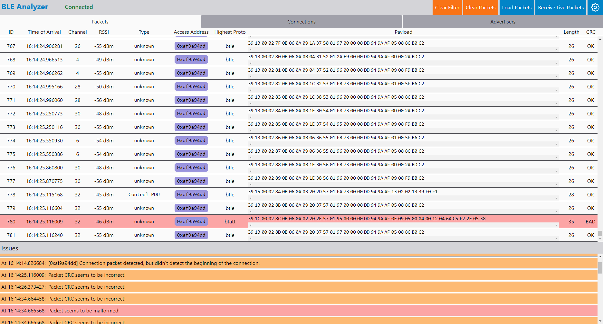

# ble-analyzer-server
A tool for displaying and analyzing Bluetooth Low-Energy (BLE) packet streams in pcapng format. Supports both recorded and live sessions. Server part only.



## Getting Started

### Quickstart

You can download & use pre-built binaries for Windows and Linux (x64) from [the releases page](https://github.com/Chaphasilor/ble-analyzer-server/releases).  
All commands and arguments are just the same with it, simply replace `node index` with the path to the binary.  
You'll also have to set the environment variables manually, or use a `.env` file (see below).

### Dev Setup

#### Prerequisites

After cloning, create a file called `.env` in the project root.  
There you can specify the environment variables:

```s
PORT=70 # just an example
environment=development # or `debug` or `production`
```

You'll need to have Node.js 14 or higher (and `npm`) installed.  
Also make sure that [`tshark`](https://tshark.dev/) (the CLI version of Wireshark) is installed on your system and in your `PATH`, so that you can run `tshark` from any terminal.

#### Installation

```sh-session
$ npm install
```

### Startup/Usage

The server requires a Bluetooth LE packet stream in `pcap-ng` format as input.  
You can either:

- Specify a file with an existing recording (`node index /path/to/pcap-ng-recording`) ***or***
- Use a pipe to stream live data to the server (`node index < <stream source>` for Windows CMD, `<stream source> | node index` for Linux)

After starting the server like described above, it starts listening at `ws://127.0.0.1:<PORT>`, where `<PORT>` is the port you specified in the `PORT` environment variable (e.g. in `.env`).  
You can then paste this websocket URL (e.g. `ws://127.0.0.1:70` or ``wss://server.example.com`) into the [GUI](https://github.com/Chaphasilor/ble-analyzer-gui) (you can also use the [live demo GUI here](https://ble-analyzer-gui.netlify.app/)) to start analyzing packets.  
After clicking on `Confirm URL`, you can either click on `Load Packets` to load all received packets up to now, or click `Receive Live Packets` to continously monitor incoming packets received by the server.
